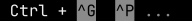
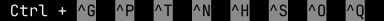
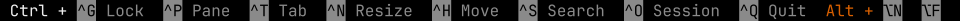

# Zellij Status Bar Next-Generation

[](https://github.com/fulldecent/zellij-status-bar-ng/actions/workflows/lint.yml) [](https://github.com/fulldecent/zellij-status-bar-ng/actions/workflows/build-test.yml)

A drop-in replacement for Zellij’s default `status-bar` plugin. Same key-hint information, drawn like GNU nano instead of chevron / powerline pills, with improved layout across terminal widths. Colors follow the active Zellij theme. The goal is to become the default status bar.

Zellij Status Bar Next-Generation offers:

* A wasm you can drop into `~/.config/zellij/plugins` without compiling
* A stable reverse-DNS file name so upgrades overwrite the same path
* A signed sidecar next to that file so you can check which release you installed
* Width-aware GNU nano shortcut chips that stay inside the screen


This is a [Zellij](https://zellij.dev/) plugin and supports Zellij 0.45 or newer.

It does not depend on [Zellij Tab Bar Ribbons](https://github.com/fulldecent/zellij-tab-bar-ribbons) or on zjstatus. You can install this plugin alone.

## Try it out

1. Select the latest wasm release and install to your plugins folder:

   ```sh
   name="com.github.fulldecent.zellij-status-bar-ng.wasm"
   base="https://github.com/fulldecent/zellij-status-bar-ng/releases/latest/download"
   mkdir -p ~/.config/zellij/plugins
   curl -fL -o ~/.config/zellij/plugins/"$name" "$base/$name"
   curl -fL -o ~/.config/zellij/plugins/"${name}.sigstore.jsonl" "$base/${name}.sigstore.jsonl"
   ```

   The release asset names match this local file. `curl -f` fails if the wasm or the sidecar is missing.

   Check the file against the sidecar:

   ```sh
   gh attestation verify ~/.config/zellij/plugins/"$name" \
     -R fulldecent/zellij-status-bar-ng \
     --bundle ~/.config/zellij/plugins/"${name}.sigstore.jsonl"
   ```

2. Point the `status-bar` alias at that file. Zellij’s default layout puts whatever plugin is aliased as `status-bar` on the bottom row.

   Open `~/.config/zellij/config.kdl`. Change the existing `status-bar` line. Zellij 0.45.1 loads an absolute `file:` URL. `~` inside the quoted string is not a home directory.

   ```sh
   printf '    status-bar location="file:%s/.config/zellij/plugins/com.github.fulldecent.zellij-status-bar-ng.wasm"\n' "$HOME"
   ```

3. Start a new session. Quit Zellij, or open a new terminal and run `zellij`. The session that is already running keeps the plugin it started with.

4. Grant `ReadApplicationState`, `ChangeApplicationState`, and `RunActionsAsUser` when Zellij asks. Click that row and press `y`.

## Installation

Complete the [try it out instructions](#try-it-out) above to download the plugin.

You will now be adding this plugin to your default layout.

1. First, create a default layout if you don't already have one:

   ```sh
   mkdir -p ~/.config/zellij/layouts
   DEST=~/.config/zellij/layouts/default.kdl
   [ -f "$DEST" ] || zellij setup --dump-layout default > $DEST
   ```

2. Then, replace `status-bar` with this plugin:

   ```diff
   - plugin location="status-bar"
   + plugin location="file:~/.config/zellij/plugins/com.github.fulldecent.zellij-status-bar-ng.wasm"
   ```

   Or, non-interactively:

   ```sh
   plugin="${HOME}/.config/zellij/plugins/com.github.fulldecent.zellij-status-bar-ng.wasm"
   DEST=~/.config/zellij/layouts/default.kdl
   sed -i '' \
     -e "s|plugin location=\"status-bar\"|plugin location=\"file:${plugin}\"|" \
     -e "s|plugin location=\"file:.*com.github.fulldecent.zellij-status-bar-ng\\.wasm\"|plugin location=\"file:${plugin}\"|" \
     "$DEST"
   ```

Repeat the same try it out + installation steps to upgrade. The wasm file name is stable, so upgrading overwrites that file and your layout path stays the same. The sidecar next to it records which release version you downloaded.

Three mistakes that leave the stock chevrons on screen:

1. Adding a new name, such as `nano location="file:…"`. The default layout never asks for `nano`. The alias must be `status-bar`.
2. Putting the path in `load_plugins { }`. That block starts background plugins. The status bar is not one of them.
3. Staying inside the session you already had open. A new tab is not a new session. Plugin paths are read when a session starts.

If there is no GitHub release yet, build the wasm (see Development) and copy `target/wasm32-wasip1/release/plugin.wasm` to `~/.config/zellij/plugins/com.github.fulldecent.zellij-status-bar-ng.wasm`.

## Usage

In Normal mode the bottom line shows chips such as `^G Lock` and `Alt + ⌥N New Pane`, with no ``. `Ctrl +` is bold. The chip is the theme’s dark ribbon color on the ribbon gray, and the label is that gray on the bar.

Click a chip to run that action. Hover inverts the hit target’s colors. A combo such as `⌥←↓↑→` highlights and clicks one arrow. A chip such as `^N Resize` is nine cells, all one target.

### GNU nano display of shortcuts

The current Zellij status bar uses an angle-bracket glyph between keyboard shortcuts. We believe this is incorrect because in other UIs, this glyph is associated with breadcrumbs and denoting a parent-child relationship between the left and right item. The GNU nano approach is more succinct, and its metaphor is familiar for showing keyboard shortcuts.

80 columns:


### Responsive display

A wide terminal keeps labels. A narrow one shortens names, then drops names from the right, then drops keys from the right with `...`, and only then a colored `...`. The visible width never exceeds the screen.

20 columns:



40 columns:



100 columns:



Widths 1 through 100 are covered by `tests/widths.rs`. The pictures are SVG from [Zellij Plugin Snapshot](https://github.com/fulldecent/zellij-plugin-snapshot).

### Revert to the stock status bar

```kdl
status-bar location="zellij:status-bar"
```

## Development

Thank you for taking an interest in improving Zellij Status Bar Next-Generation.

You will need [rustup](https://rust-lang.github.io/rustup/), Git and your platform's native build tools. This project pins the toolchain in [rust-toolchain.toml](rust-toolchain.toml); rustup reads that file and installs matching `rustc`, Cargo, rustfmt, Clippy and the `wasm32-wasip1` target.

A packaged `rustc` or `cargo` from apt, dnf or Homebrew does not apply `rust-toolchain.toml`. Install rustup, then invoke the toolchain rustup selected:

```sh
"$(rustup which rustc)" --version
"$(rustup which cargo)" --version
```

`rustup which` prints the binary for the active toolchain (from `rust-toolchain.toml` in this directory). Quoting the command substitution runs that binary even when another `rustc` or `cargo` is earlier on `PATH`.

### Linux

On Ubuntu 22.04+ or Debian 12+:

```sh
sudo apt update
sudo apt install git build-essential rustup
```

On Fedora:

```sh
sudo dnf install git gcc rustup
```

If your distribution has no `rustup` package, follow [other rustup installation methods](https://rust-lang.github.io/rustup/installation/other.html).

### macOS

```sh
xcode-select --install
brew install git rustup
```

Homebrew's `rust` formula is a standalone compiler. It does not honor `rust-toolchain.toml`. Use `rustup` instead.

### Windows

```powershell
winget install --exact --id Git.Git
winget install --exact --id Microsoft.VisualStudio.2022.BuildTools --override "--wait --passive --norestart --add Microsoft.VisualStudio.Workload.VCTools --includeRecommended"
winget install --exact --id Rustlang.Rustup
```

Clone the project and build:

```sh
git clone https://github.com/fulldecent/zellij-status-bar-ng.git
cd zellij-status-bar-ng
"$(rustup which rustc)" --version
"$(rustup which cargo)" --version
"$(rustup which cargo)" check --locked
"$(rustup which cargo)" build --locked
```

> [!NOTE]
> Run those lines from this repository. `rust-toolchain.toml` is how the version is selected. If a check fails with “compiled by an incompatible version of rustc”, another compiler already wrote `target/`. That directory is gitignored. Remove it (`rm -rf target`) and run the same four lines again.

Run this directly with:

```sh
zellij --layout layout/plugin-dev.status-bar.kdl
```

### Testing

```sh
"$(rustup which cargo)" test --locked --target "$("$(rustup which rustc)" -vV | sed -n 's/^host: //p')"
"$(rustup which cargo)" fmt --all -- --check
"$(rustup which cargo)" clippy --all-targets --locked -- -D warnings
"$(rustup which cargo)" build --release --locked
```

`cargo test` runs the Rust tests in `src/` and `tests/widths.rs`. [tests/snapshot.sh](tests/snapshot.sh) builds the release wasm, runs [shots/screenshot.yaml](shots/screenshot.yaml), and exits non-zero unless those bytes match [shots/screenshot.ansi.txt](shots/screenshot.ansi.txt).

```sh
"$(rustup which cargo)" install zellij-plugin-snapshot --version 0.2.2 --locked
sh tests/snapshot.sh
```

```sh
npx prettier@latest --check . --write
npx markdownlint-cli@latest "**/*.md" --fix
```

### Releases

Use `fix:`, `feat:` or `BREAKING CHANGE:` in your commit messages. Merging the Release Please pull request triggers a new tag and GitHub Release.

The wasm file name is `com.github.fulldecent.zellij-status-bar-ng.wasm`. Set the version in [Cargo.toml](Cargo.toml) and [Cargo.lock](Cargo.lock) to the proposed release version before merging the release pull request.

### Maintenance

The project administrator completes these maintenance tasks each month.

1. Identify external Actions in [.github/workflows](./.github/workflows) and update them when it is safe.
1. Review the Rust toolchain in `rust-toolchain.toml`.
1. Review [zellij-plugin-snapshot](https://github.com/fulldecent/zellij-plugin-snapshot) releases. Update every `cargo install zellij-plugin-snapshot --version` line. Regenerate [shots/screenshot.ansi.txt](shots/screenshot.ansi.txt) and [screenshot.svg](screenshot.svg) when the host output changes.

## Project scope

This status bar is intended to replace the built-in Zellij status bar ([`default-plugins/status-bar` at v0.45.1](https://github.com/zellij-org/zellij/blob/v0.45.1/default-plugins/status-bar/src/main.rs)). In this interest, we limit this project only to the following features which we consider to be the highest priority.

* GNU nano display of shortcuts
* Responsive display that never exceeds the screen
* Theme colors from the active Zellij session

Out of scope:

* No separate color scheme
* No format-string language or extra widgets
* It does not replace the tab bar
* Layouts do not point at an HTTPS plugin URL

## References

1. We use "Title Case" only for proper nouns, this includes the name of our project.
1. This project is built based on [best practices documented in zellij-plugin-template](https://github.com/fulldecent/zellij-plugin-template).
1. This project is built based on [best practices documented in rust-template](https://github.com/fulldecent/rust-template/).
1. This project is built based on [best practices documented in project-template](https://github.com/fulldecent/project-template).
1. Zellij offers another installation method that points your layout configuration to an HTTPS URL. We consider that feature wrong and deprecated.
1. We speak of the official rustup installation recommendation as ugly. [Reported upstream](https://github.com/rust-lang/rust/issues/163468).
1. Render snapshots follow [Zellij Plugin Snapshot](https://github.com/fulldecent/zellij-plugin-snapshot) 0.2.2.
1. The stock comparison renderer is derived from Zellij’s `default-plugins/status-bar` at tag `v0.45.1` (MIT). Those sources are in [`third_party/`](third_party/PROVENANCE.md).
1. This project is released under the [MIT license](./LICENSE.md).
